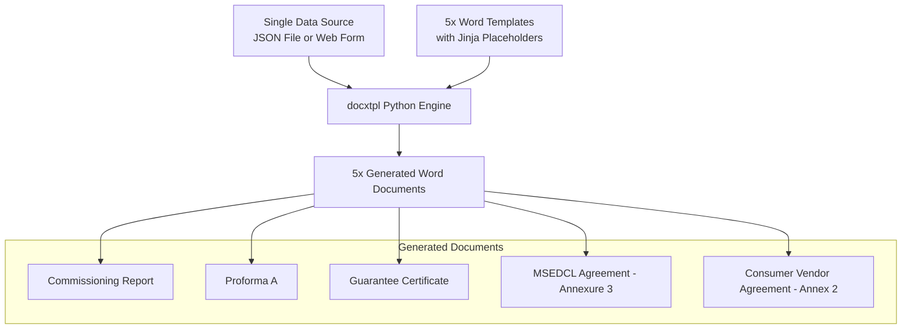

# Solar Docs Auto-Fill (Multi-Doc Writer)

A stateless offline document automation tool designed to eliminate repetitive data entry for residential solar installations. By inputting a single shared dataset (consumer name, capacity, dates, inverter specifications, vendor credentials, MSEDCL subdivision, etc.), the tool dynamically renders **5 distinct Word documents** required for net-metering and commissioning in Maharashtra (MSEDCL).

---

## ⚡ Visual Overview & Architecture



---

## 🌟 Key Features

* **Single Source of Truth**: Input your data once (23 fields) and generate all 5 documents in seconds.
* **Premium Glassmorphic Web App**: Includes a local Flask-based web interface with logical grouping, responsiveness, and a quick-load button for sample data.
* **CLI Power-User Script**: Automate generation using a standard JSON file—ideal for batch processing.
* **Fully Configurable MSEDCL Fields**: Previously hardcoded subdivision details (Officer Designation, Subdivision Address, Taluka/District suffixes) are now fully configurable input fields with smart fallbacks to the Alibag subdivision.
* **100% Offline & Private**: Runs entirely on your local machine. No data ever leaves your computer, and no cloud subscriptions or external APIs are required.

---

## 📁 Directory Structure

```
multi_doc_writer/
├── start_web_app.bat         # Windows automated starter for the Web App
├── run_cli_sample.bat        # Windows automated runner for the CLI sample 1 (Gawand project)
├── run_cli_sample_2.bat      # Windows automated runner for the CLI sample 2 (Rane project)
├── app.py                     # Flask web app (interactive form + zip download)
├── generate_docs.py           # CLI script (reads JSON, outputs individual docx files)
├── sample_input.json          # First example consumer dataset (Gawand project)
├── sample_input_2.json        # Second example consumer dataset (Rane project)
├── verify_rendered.py         # Verification script to ensure no unresolved placeholders
├── templates/                 # Render-ready Word templates with Jinja2 placeholders
│   ├── Annex2_TEMPLATE.docx
│   ├── Annexure3_TEMPLATE.docx
│   ├── Commissioning_Report_TEMPLATE.docx
│   ├── Guarantee_Certificate_TEMPLATE.docx
│   └── Proforma_A_TEMPLATE.docx
├── originals/                 # Untouched reference Word documents
└── doc/                       # Historical handoff and architecture documentation
```

---

## ⚙️ Quick Start Installation

### Prerequisites
Make sure you have **Python 3.9+** installed on your system.
* **Windows**: Download from [python.org/downloads](https://www.python.org/downloads/). During installation, make sure to check **"Add Python to PATH"**.

### Setup Instructions
1. Open your terminal (PowerShell or Command Prompt on Windows).
2. Navigate to the project folder:
   ```bash
   cd "E:\webstack\multi_doc_writer"
   ```
3. Install the required dependencies:
   ```bash
   pip install docxtpl flask
   ```
   *Note: If you are using a managed Python environment, you may need to use `pip install docxtpl flask --break-system-packages`.*

---

## 🚀 How to Run the Tool

You can use either the Web Application (recommended for everyday use) or the CLI Script (recommended for automation).

### Quick Automated Startup (Windows Only)
* **To run the Web Form**: Double-click [start_web_app.bat](file:///E:/webstack/multi_doc_writer/start_web_app.bat). It automatically checks and installs dependencies, launches the server, and opens your browser to `http://127.0.0.1:5001`.
* **To run CLI sample 1 (Gawand)**: Double-click [run_cli_sample.bat](file:///E:/webstack/multi_doc_writer/run_cli_sample.bat). It runs the generator using `sample_input.json` and opens the output folder.
* **To run CLI sample 2 (Rane)**: Double-click [run_cli_sample_2.bat](file:///E:/webstack/multi_doc_writer/run_cli_sample_2.bat). It runs the generator using `sample_input_2.json` and opens the output folder.

---

### Method 1: The Interactive Web Form (Manual)
1. In your terminal, run:
   ```bash
   python app.py
   ```
2. Open your web browser and navigate to:
   ```
   http://127.0.0.1:5001
   ```
3. **UX Tip**: Click the **"⚡ Load Sachin Gawand Sample"** button at the top to instantly populate the form with a complete working dataset.
4. Modify any fields as needed and click **"Generate & Download ZIP"** to retrieve all 5 completed files.

> [!TIP]
> **Network Sharing**: To access the form from a mobile phone or another device on the same local network, run the server with:
> `python app.py --network` and connect to `http://<your-computer-ip>:5001`.

---

### Method 2: The Command Line Interface (CLI - Manual)
1. Modify `sample_input.json` or create a new JSON file with your consumer data.
2. In your terminal, run the generator script:
   ```bash
   python generate_docs.py sample_input.json
   ```
3. The filled documents will be output to a subdirectory under `output/` named after the consumer, e.g., `output/SACHIN_SAHDEV_GAWAND/`.

---

## 📝 Document-to-Field Mapping (Jinja Placeholders)

The following schema is the single source of truth used across the templates:

| Field Name | Description | Used In |
| :--- | :--- | :--- |
| `consumer_name` | Consumer Full Name | All 5 docs |
| `consumer_number` | MSEDCL Consumer Number (12 digits) | Commissioning, Annexure 3, Annex 2 |
| `mobile_number` | Contact Mobile Number | Commissioning Report |
| `email` | Contact Email Address | Commissioning Report |
| `install_address` | Address of solar installation | Commissioning, Proforma A, Annexure 3, Annex 2 |
| `consumer_residential_address` | Consumer signature block address | Annex 2 only |
| `consumer_residential_address_suffix` | Consumer address district suffix (default provided) | Annex 2 only |
| `sanctioned_capacity_kw` | MSEDCL Sanctioned load in kW | Commissioning, Proforma A, Annexure 3 |
| `rooftop_capacity_kw` | Actual solar installation capacity in kW | Commissioning Report |
| `module_make` | PV Solar Panel Module make/brand | Commissioning Report |
| `inverter_capacity_kw` | Inverter rating capacity in kW | Commissioning Report |
| `inverter_make` | Inverter brand/manufacturer | Commissioning Report |
| `pv_module_count` | Number of physical PV solar panel modules | Commissioning Report |
| `module_capacity_watt` | Total solar capacity of solar panel modules in Watt | Commissioning Report |
| `installation_date` | Date of solar installation (e.g. 4-June-2026) | Commissioning, Proforma A |
| `agreement_date` | Date of connection agreement (e.g. 22/06/2026) | Annexure 3, Annex 2 |
| `execution_date_text` | Execution date in full text (e.g. 22nd of June 2026) | Annex 2 only |
| `vendor_name` | Vendor short name (e.g. S S Powertech) | Proforma A |
| `vendor_name_full` | Vendor formal name with M/S prefix | Proforma A, Annex 2 |
| `vendor_address` | Vendor registered street address | Annex 2 only |
| `vendor_address_suffix` | Vendor address district suffix (default provided) | Annex 2 only |
| `officer_designation` | Subdivision Officer designation (default provided) | Annexure 3 only |
| `subdivision_address` | Subdivision registered office address (default provided) | Annexure 3 only |

---

## 🛠️ Verification & Safety Checks

We have included a validation script `verify_rendered.py` to ensure all documents are generated cleanly:
```bash
python verify_rendered.py
```
This script unzips the generated files in `output/` and scans their XML source code for any un-rendered Jinja placeholders (e.g., `{{ field }}`). It guarantees that your client files are 100% filled and ready for submission.

---

## 🤝 Support & Extending the Code
* To add a new document to the generation batch, simply save it in the `templates/` folder and append its filename to the `TEMPLATES` list in `app.py` and `generate_docs.py`.
* Ensure that any new Jinja placeholders are added to the input fields mapping in both scripts.

---

## 🌐 cPanel / CloudLinux Deployment Guide

Follow these steps to deploy this Flask application on a cPanel-hosted domain or subdomain (e.g., `autodocumentation.sspowertech.com`):

### 1. File Upload Setup
Upload only the necessary production files to your subdomain root directory (e.g., `/home/sspowertech/autodocumentation.sspowertech.com/`). Do **not** upload `node_modules`, python local environments, or zip backups.

**Files to upload:**
*   `app.py` (Flask main application)
*   `passenger_wsgi.py` (cPanel WSGI loader)
*   `requirements.txt` (Dependencies list)
*   `templates/` (Your Word `.docx` templates)
*   `doc/` and `originals/` (Optional reference files)

---

### 2. cPanel Python App Setup
1. Log in to your **cPanel** dashboard.
2. Search for and open **"Setup Python App"**.
3. Click **"Create Application"** and configure:
   * **Python Version**: `3.10`
   * **Application root**: `autodocumentation.sspowertech.com` (this must match the directory name)
   * **Application URL**: Select `autodocumentation.sspowertech.com` from your domains dropdown.
   * **Application startup file**: `passenger_wsgi.py`
   * **Application Entry point**: `application` (all lowercase, matching the variable in your loader script)
4. Click **"Create"**.

---

### 3. Dependency Installation
1. Scroll down to the **"Configuration files"** section of your Python App page in cPanel.
2. Add `requirements.txt` to the textbox and click **Add** (if it isn't automatically showing).
3. Click **"Run pip install"** and select `requirements.txt`.
   * *This installs Flask and docxtpl in the virtual environment.*
4. Click **Restart** at the top of the Setup page.

---

### 4. Configuration Files Reference

#### A. Subdomain `.htaccess`
cPanel will automatically generate or write to `.htaccess` in your subdomain root. Ensure it contains the following Passenger instructions:
```apache
# DO NOT REMOVE. CLOUDLINUX PASSENGER CONFIGURATION BEGIN
PassengerAppRoot "/home/sspowertech/autodocumentation.sspowertech.com"
PassengerBaseURI "/"
PassengerPython "/home/sspowertech/virtualenv/autodocumentation.sspowertech.com/3.10/bin/python"
# DO NOT REMOVE. CLOUDLINUX PASSENGER CONFIGURATION END

# DO NOT REMOVE OR MODIFY. CLOUDLINUX ENV VARS CONFIGURATION BEGIN
<IfModule Litespeed>
</IfModule>
# DO NOT REMOVE OR MODIFY. CLOUDLINUX ENV VARS CONFIGURATION END
```

#### B. `passenger_wsgi.py`
This loader file binds your Flask application (`app.py`) to the Passenger web server. It also writes tracebacks to `passenger_error.log` if the application fails to start:
```python
import os
import sys

# Add application directory to the system path
APP_DIR = os.path.dirname(os.path.abspath(__file__))
sys.path.insert(0, APP_DIR)

# Import the Flask application object and catch errors for diagnostic log
try:
    from app import app as flask_app
except Exception as e:
    with open(os.path.join(APP_DIR, 'passenger_error.log'), 'w') as f:
        import traceback
        traceback.print_exc(file=f)
    raise e

# Middleware to handle subdirectory prefix routing
SUBDIRECTORY_PREFIX = ''

class PrefixMiddleware:
    def __init__(self, wsgi_app, prefix=''):
        self.wsgi_app = wsgi_app
        self.prefix = prefix

    def __call__(self, environ, start_response):
        path_info = environ.get('PATH_INFO', '')
        if path_info.startswith(self.prefix):
            environ['PATH_INFO'] = path_info[len(self.prefix):]
            environ['SCRIPT_NAME'] = self.prefix
        return self.wsgi_app(environ, start_response)

if SUBDIRECTORY_PREFIX:
    application = PrefixMiddleware(flask_app, prefix=SUBDIRECTORY_PREFIX)
else:
    application = flask_app
```

---

### 5. Troubleshooting
* **500 Internal Server Error (No log file)**: If you get a 500 error and no `passenger_error.log` is generated, it means Python is failing to start entirely. Ensure the path in `PassengerPython` inside `.htaccess` exists and points to a valid virtualenv binary.
* **500 Internal Server Error (With log file)**: If a `passenger_error.log` is created in your directory, check it for tracebacks (such as missing packages). Run the `pip install` action again inside your cPanel Python Setup page.
* **Web Server Errors (PHP / Static conflicts)**: Ensure that your Passenger configurations are only kept inside the subdomain `.htaccess` file, and not duplicated or conflicted in the parent account root directory (`/home/sspowertech/.htaccess`).

